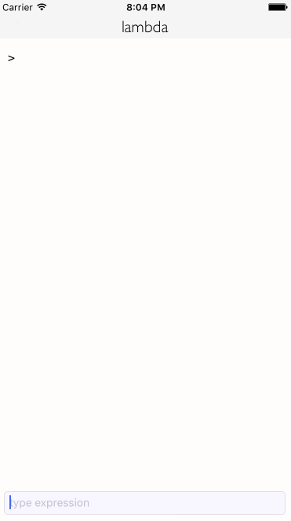

# lambda-iOS
A subset of Lisp as an app on iOS, based on the Lambda dialect of Lisp (https://github.com/reddragon/lambda). This is a WIP, and right now I only have a barebones version ready.

### Demo

